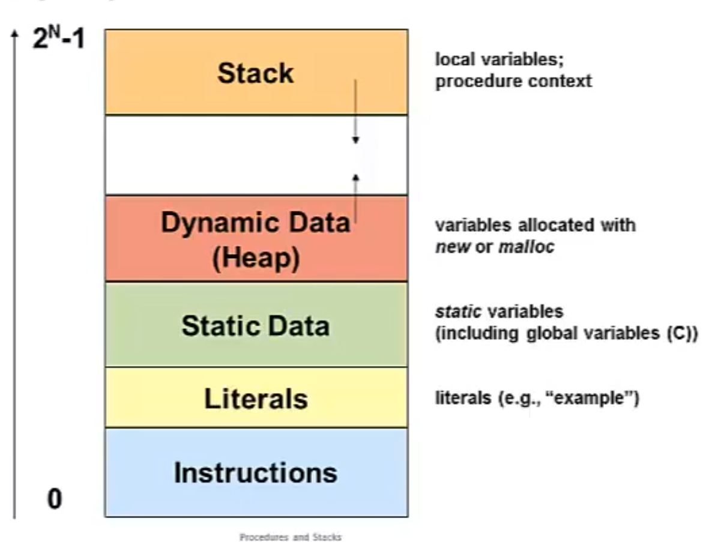

+++
date = '2026-04-12T03:36:13+03:00'
draft = false
title = 'Procedures'
toc = true
weight = 30
+++

# Procedures & Stacks

- Stacks in memory and stack operations
- The stack used to keep trach of procedure calls
- Return addresses and return values
- Stack-based languages
- The Linux stack frame
- Passing arguments on the stack
- Allocating local variables on the stack
- Register-saving conventions
- Procedures and stacks on x64 architecture

